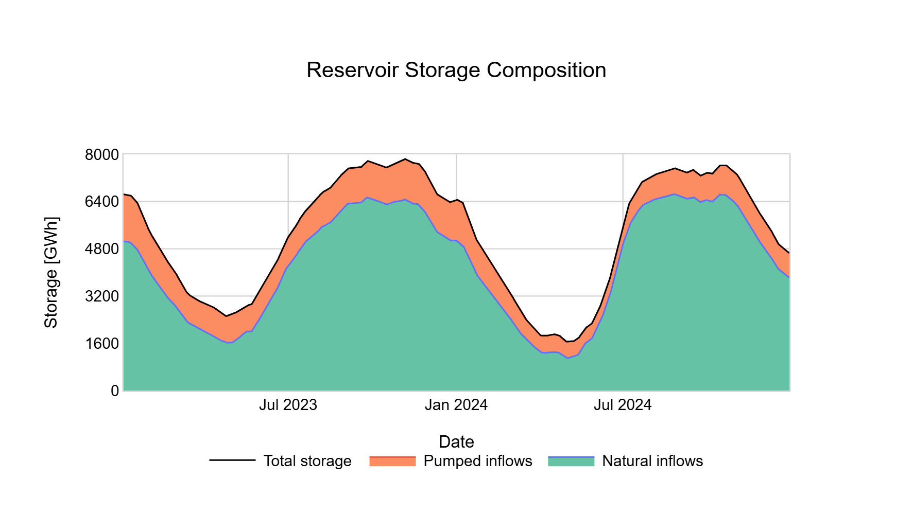
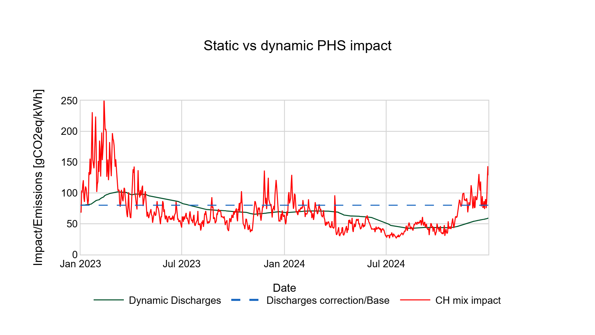

Dynamic Pumped Hydro Storage (PHS)
==================================

Overview
--------

The **Dynamic PHS module** improves the environmental assessment of Swiss Pumped Hydro Storage (also known as pumped-storage hydropower).

Unlike standard Life Cycle Assessment (LCA) approaches that use a static carbon coefficient (e.g., a yearly average), this module calculates a **dynamic, hourly carbon intensity** for the electricity generated by PHS plants.

It accounts for:

* **Real-time Grid Mix:** The actual carbon footprint of the electricity consumed during pumping hours.
* **Physical Inertia:** The storage capability of reservoirs (water pumped weeks ago mixes with water pumped today).
* **Natural Dilution:** The mixing of pumped water with natural inflows (rain, meltwater), which are carbon-neutral.

Methodology: How it works
-------------------------

The model relies on a dual-layer approach: a **Hydraulic Mass Balance** and a **Recursive Carbon Tracking**.
To obtain the results, only the total capacity of Swiss reservoirs is used, and this from 2023 onwards.

1. Reservoir Composition
~~~~~~~~~~~~~~~~~~~~~~~~

The model conceptually splits the reservoir volume *V* into two mixing compartments:

* **Natural Stock** (:math:`S_N`): Water from natural inflows (rain, snowmelt). Considered **0 gCO2eq/kWh**.
* **Pumped Stock** (:math:`S_P`): Water pumped from the grid. Carries the carbon intensity of the grid at the time of pumping.

The first step is to determined the physical composition of the reservoir at each time step *t*. The hydraulic mass balance equation allows to obtain the natural income.

.. math::
    Q_{nat}(t) = [S(t)-S(t-1)] + P_{out}(t) - P_{in}(t)

Where :

* :math:`S(t)` : Reservoir level at time *t* [MWh]
* :math:`P_{in}(t)` : Pumped energy at time *t* [MWh]
* :math:`P__{out}(t)` : Discharge energy at time *t* [MWh]

At every time step *t*, the module calculates an intermediate state (called with a tilde ~) before discharge :

.. math::

    \tilde{S_{N}}(t) = S_{N}(t-1) + Q_{nat}

.. math::

    \tilde{S_{P}}(t) = S_{P}(t-1) + P_{in}

The share of pumped water in the reservoir is defined by the ratio :math:`alpha` :

.. math::

    \alpha(t) = \frac{\tilde{S}_P(t)}{\tilde{S}_P(t) + \tilde{S}_N(t)}

The final shares of the reservoir are obtained after substracting the outcomes (discharge and overflow) from their proportional presence :

.. math::

    S_{P}(t) = \tilde{S_{P}}(t-1) - \alpha(t) \cdot (turbinage(t) + overflow(t))

.. math::

    S_{N}(t) = \tilde{S_{N}}(t-1) - (1 - \alpha(t)) \cdot (turbinage(t) + overflow(t))

   *Example of reservoir composition dynamics*

2. Recursive Carbon Intensity
~~~~~~~~~~~~~~~~~~~~~~~~~~~~~

The carbon intensity of the PHS generation :math:`I_PHS(t)` is updated hourly. It is a weighted average of the **old stock's intensity** and the **new pumping intensity**:

.. math::

   I_{PHS}(t) = f_{renew}(t) \cdot I_{mix} + (1 - f_{renew}(t)) \cdot I_{PHS}(t - 1)

Where:

* :math:`I_{PHS}(t)`: Dynamic carbon intensity of the PHS [gCO2eq/kWh].
* :math:`I_{Mix}(t)`: Carbon intensity of the Swiss consumption mix at hour *t*.
* :math:`f{renew}(t)`: Renewal factor (ratio of new pumped volume to total stock).

.. math::

   f_{renew}(t) = \frac{P_{in}(t)}{S_{P}(t)}

Data Requirements
-----------------

To function correctly, this module requires specific data streams that distinguish physical flows from commercial accounting:

1.  **Gross Flows (Pronovo):** Distinct metering for Discharge (Turbining) and Storage (Pumping). *Net ENTSO-E data is insufficient.*
2.  **Storage Levels (Energy Charts):** Weekly filling levels of Swiss reservoirs (interpolated to hourly values).

Usage
-----

This feature is optional and can be toggled in the configuration parameters.

When enabled, the application replaces the static emission factor (default ~80 gCO2eq/kWh) with the calculated dynamic time-series.

**Result Comparison:**

   *Impact comparison: The dynamic method (green) captures the low-carbon nature of pumping during renewable-rich periods, often resulting in lower emissions than the static baseline (red).*
